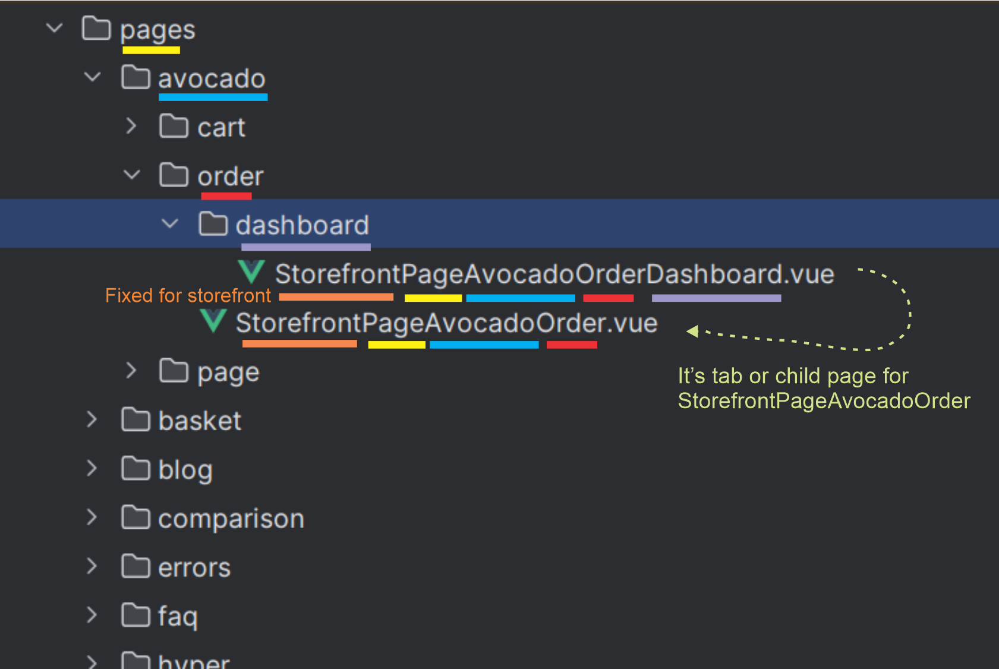

# Storefront Code Structure

## Folders Overview
The Selldone Storefront project organizes its codebase into several key directories, each serving a specific function in
the development of a Vue.js application. Below is an overview of these directories and their purposes:

| Directory    | Purpose                                                                                   |
|--------------|-------------------------------------------------------------------------------------------|
| `components` | Stores custom Vue components used throughout the storefront.                              |
| `lang`       | Contains i18n language files for supporting multiple languages and managing translations. |
| `layouts`    | Houses app's master layouts, defining the overall structure of the application's UI.      |
| `pages`      | Contains the pages of the app, each representing a different page within the application. |
| `router`     | Holds Vue Router files for managing routing, navigation, and route-related logic.         |
| `store`      | Stores VueX store files for state management across the application.                      |

## File Naming

